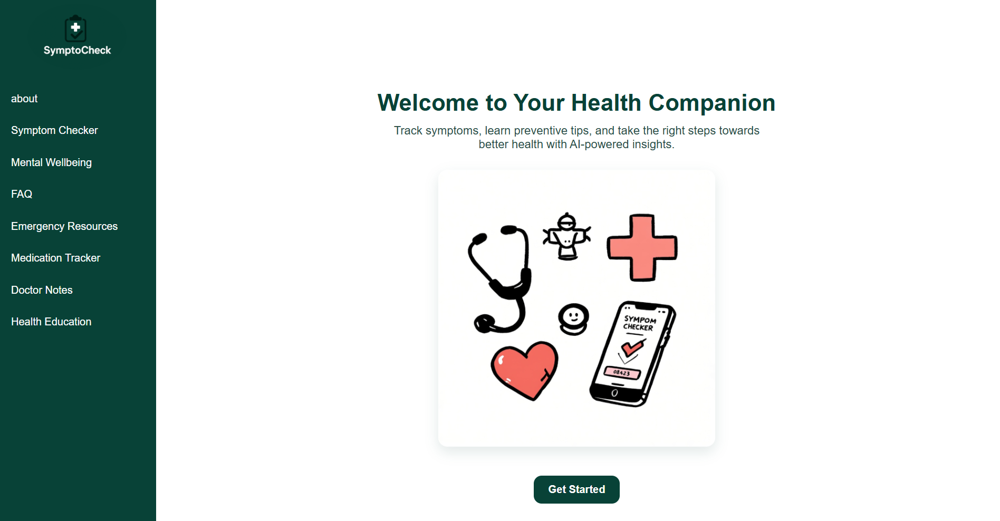
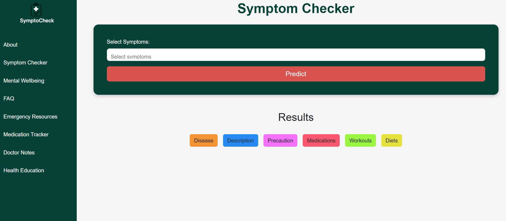
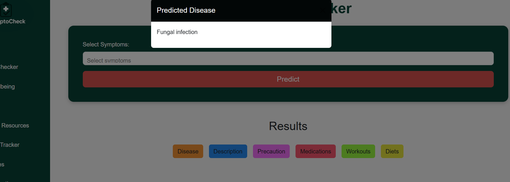
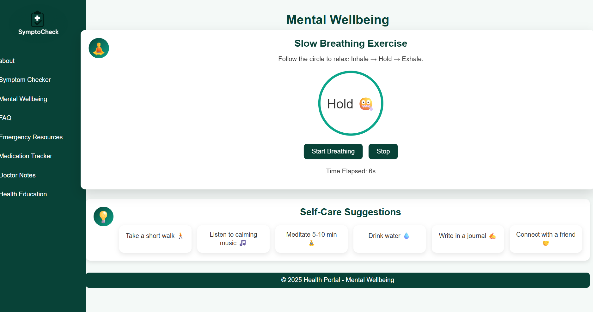
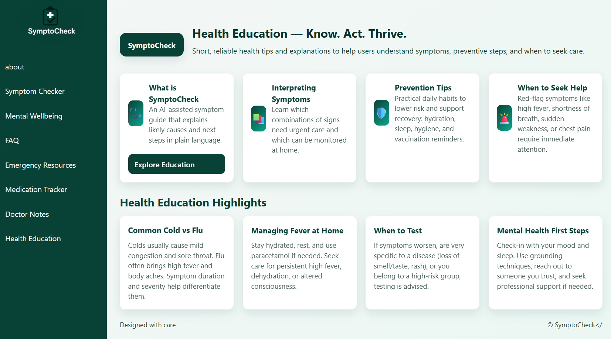

# SymptoCheck 🩺

An ML-powered symptom analysis web application built with Flask and Python.

SymptoCheck allows users to select symptoms and receive a predicted disease category using a pre-trained Support Vector Classifier (SVC). The application also provides related information such as disease descriptions, precautions, medications, diets, and workout recommendations.

> **Disclaimer:** SymptoCheck is an educational/informational project and is not intended to provide medical diagnosis or replace professional medical advice.

---

## ✨ Features

### 🤖 ML-Powered Symptom Analysis

- Select multiple symptoms through the web interface.
- Converts selected symptoms into a binary feature vector.
- Uses a pre-trained SVC machine learning model for prediction.
- Displays the predicted disease category.

### 📋 Disease Information

Based on the predicted disease, the application provides:

- Disease description
- Precautions
- Medication information
- Diet recommendations
- Workout recommendations

### 🧘 Mental Wellbeing

- Guided slow-breathing exercise
- Self-care suggestions
- Mental wellbeing resources

### 💊 Medication Tracker

- Add medications
- Schedule medication times
- View scheduled medications

### 📝 Doctor Notes

- Add doctor notes
- Store notes with dates and descriptions
- View saved notes

### 📚 Health Education

Provides educational content covering topics such as:

- Understanding symptoms
- Prevention tips
- When to seek professional help
- Common health conditions
- Mental health awareness

### 🚨 Emergency Resources

Provides emergency-related information including:

- Important emergency contacts in India
- Safety measures
- First-aid guidance
- Emergency action flow

### ❓ FAQ

Provides answers to frequently asked questions about the health portal and its features.

---

## 🧠 Machine Learning Workflow

The symptom prediction process follows this workflow:

```text
User selects symptoms
        ↓
Symptoms converted into binary feature vector
        ↓
Pre-trained SVC model
        ↓
Disease prediction
        ↓
Disease-specific information retrieved
        ↓
Results displayed to the user

## 🛠️ Tech Stack

### Backend
- Python
- Flask

### Machine Learning
- Scikit-learn
- Support Vector Classifier (SVC)
- Pickle

### Data Processing
- NumPy
- Pandas

### Frontend
- HTML
- CSS
- JavaScript

### Data
- CSV datasets for symptoms, disease descriptions, precautions, medications, diets, and workouts


## 📁 Project Structure

```text
SymptoCheck/
│
├── dataset/
│   ├── description.csv
│   ├── diets.csv
│   ├── medications.csv
│   ├── precautions_df.csv
│   ├── symptoms_df.csv
│   └── workout_df.csv
│
├── models/
│   └── symptom.pkl
│
├── static/
├── templates/
├── main.py
├── Logo.jpg
├── .gitignore
└── README.md

## 🚀 Getting Started

### Prerequisites

- Python 3.x
- pip

### Clone the repository

```bash
git clone https://github.com/bhoomibindal/SymptoCheck.git
```

### Navigate to the project

```bash
cd SymptoCheck
```

### Create a virtual environment

```bash
python -m venv .venv
```

### Activate the virtual environment

On Windows:

```bash
.venv\Scripts\activate
```

### Install dependencies

```bash
pip install flask numpy pandas scikit-learn
```

### Run the application

```bash
python main.py
```

Open:

```text
http://127.0.0.1:5000
```

## 📸 Screenshots

### Home Page



### Symptom Checker



### Prediction Result



### Mental Wellbeing



### Health Education



## 🌱 Future Improvements

- Improve model evaluation and validation
- Add model performance metrics
- Improve symptom search and selection
- Add persistent user accounts
- Store medication and doctor notes in a database
- Improve mobile responsiveness
- Deploy the application
- Improve accessibility

## ⚠️ Disclaimer

SymptoCheck is an educational/informational project.

The predictions and health-related information provided by the application should not be considered professional medical advice, diagnosis, or treatment.

Users should consult qualified healthcare professionals for medical concerns.

## 👩‍💻 Author

**Bhoomi Bindal**

GitHub: https://github.com/bhoomibindal

LinkedIn: http://www.linkedin.com/in/bhoomi-bindal-90b029144